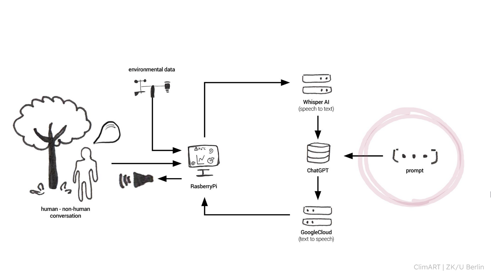
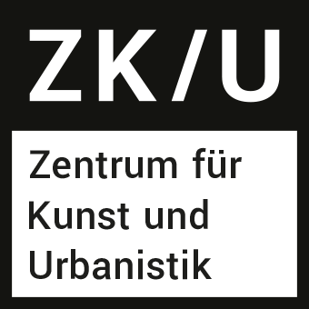

# GPTree, a talking tree
## Data Flow and Services
We use a Python script to send a voice recording of user to multiple AI APIs:
- [Whisper](https://openai.com/research/whisper) for speech-to-text
- [ChatGPT 3.5](https://platform.openai.com/docs/models/gpt-3-5) as LLM that generates an answer
- [Google Cloud text-to-speech service](https://cloud.google.com/text-to-speech) to let the answer sound like a real character

## Credits
Danke an das CityLab Berlin! 
- Projekt [Kiezbot](https://citylab-berlin.org/de/exhibition/kiezbot/)
- Initialer code: https://github.com/technologiestiftung/kiezbot

<table>
    <td>
      Im Rahmen des ClimArt-Projekts von
       
    </td>
    <td>
      Initialer code vom 
       
    </td>
  </tr>
  <tr>
    <td>
      
    </td>
    <td>
      
    </td>
  </tr>
</table>

<!-- ALL-CONTRIBUTORS-BADGE:START - Do not remove or modify this section -->

<!-- ALL-CONTRIBUTORS-BADGE:END -->
